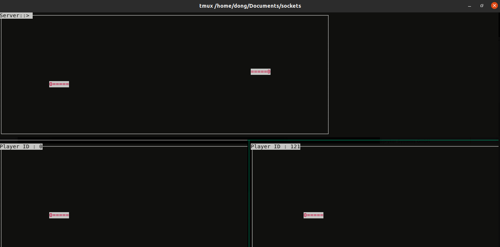

# multiplayer-snake-game
This is a multiplayer console-based snake game which was made for Network Centring Computing (Fall 2018)

## Gameplay
A player dies if it is hit on the body by any other player's head. The player who remains alive till the end wins.

## Running Server

To run the server use the following command

`python3 sockTest.py ip_address port_number number_of_players`

## Running Client

To run a client use the following command

`python3 clientTest.py ip_address_of_server port_number`

## Screenshot

